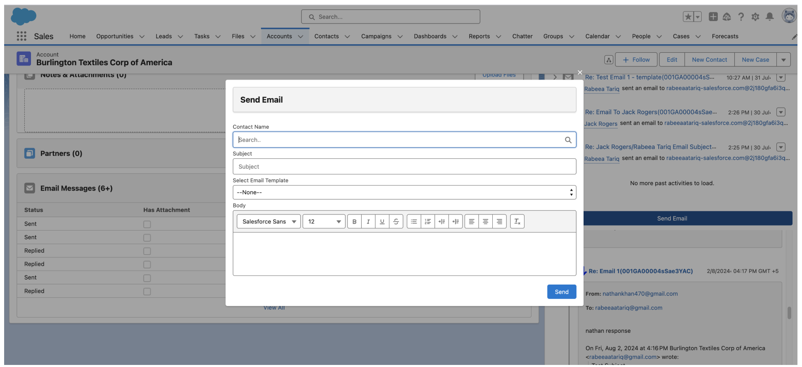
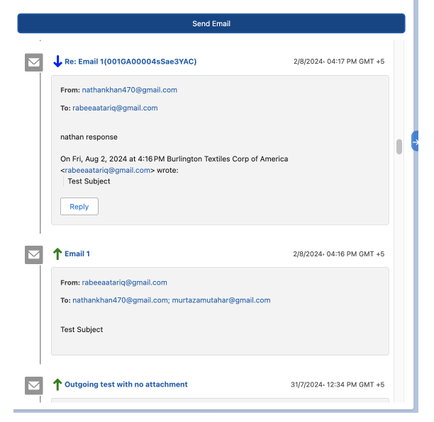

# 📧 Email to SObject Threading System


## Overview

A custom email threading solution built for Account records in Salesforce, replicating standard Email-to-Case threading functionality to enable organized email conversation tracking at the Account level. The system provides comprehensive email communication management with thread visualization, status indicators, and seamless integration with Account records for complete customer context.

**Role:** Senior Salesforce Developer  
**Duration:** 15 Days

---

## The Problem

- **No native email threading** - Account records lack Email-to-Case style conversation tracking
- **Scattered communications** - Email history fragmented across multiple locations
- **Manual tracking** - No automatic parent-child relationship between related emails
- **Lost context** - Difficult to follow conversation threads and reply chains
- **No attachment tracking** - Unable to see which emails contained documents
- **Limited visibility** - No centralized view of all Account-level communications

---

### Key Features Built

✅ **Threaded Email Visualization** - Parent-child email relationships with visual indicators  
✅ **Status Tracking** - Sent, Replied, Received states with color-coded badges  
✅ **Send Email Functionality** - Rich text editor with template selection and contact lookup  
✅ **Attachment Tracking** - "Has Attachment" indicators with file previews  
✅ **Automated Threading** - Subject line parsing and reference ID matching  
✅ **Real-Time Delivery** - MessagingSession API integration for instant email processing

---

## Technical Implementation

### Architecture Overview
```
Account Record Page
           │
           ├── Lightning Web Component (Email Thread Display)
           │   ├── Email conversation list with threading
           │   ├── Send Email modal with rich text editor
           │   ├── Status indicators (Sent/Replied/Received)
           │   └── Attachment tracking and preview
           │
           ├── Apex Controllers
           │   ├── EmailThreadController (SOQL queries)
           │   ├── EmailSendController (outbound emails)
           │   └── EmailParsingService (thread identification)
           │
           ├── Custom Objects
           │   └── Email_Message__c
           │       ├── Parent_Email__c (self-lookup)
           │       ├── Account__c (lookup)
           │       ├── Status__c (picklist)
           │       ├── Has_Attachment__c (checkbox)
           │       └── Reference_ID__c (unique identifier)
           │
           ├── Apex Triggers
           │   ├── EmailMessageTrigger (thread creation)
           │   └── InboundEmailHandler (email parsing)
           │
           └── Email Services
               ├── Inbound Email Handler
               ├── Outbound Email Sender
               └── MessagingSession API
```

### Email Threading Logic

**Thread Identification Process:**
1. Parse incoming email subject line
2. Extract reference ID from subject (e.g., "Re: Email 1(001GA00004sSae3YAC)")
3. Query for parent email using reference ID
4. Create parent-child relationship
5. Update thread hierarchy

### Tech Stack

| Component | Technology |
|-----------|-----------|
| **Frontend** | Lightning Web Components, Rich Text Editor |
| **Backend** | Apex, SOQL, Email Services |
| **Email Processing** | Inbound Email Handler, MessagingSession API |
| **Data Model** | Custom Object (Email_Message__c) with self-lookup |
| **Threading Logic** | Subject line parsing, Reference ID matching |
| **Attachments** | ContentVersion, ContentDocumentLink |

---

## Code Highlights

### Custom Email Message Object
```apex
// Email_Message__c custom object structure
Email_Message__c {
    Account__c (Lookup)
    Parent_Email__c (Self-Lookup for threading)
    Subject__c (Text)
    Body__c (Long Text Area)
    Status__c (Picklist: Sent, Replied, Received)
    Has_Attachment__c (Checkbox)
    Reference_ID__c (Text, Unique, External ID)
    From_Address__c (Email)
    To_Address__c (Email)
    Sent_Date__c (DateTime)
    Thread_Level__c (Number)
}
```

### Inbound Email Handler
```apex
global class AccountEmailHandler implements Messaging.InboundEmailHandler {
    
    global Messaging.InboundEmailResult handleInboundEmail(
        Messaging.InboundEmail email,
        Messaging.InboundEnvelope envelope
    ) {
        Messaging.InboundEmailResult result = new Messaging.InboundEmailResult();
        
        try {
            // Parse subject line for reference ID
            String referenceId = extractReferenceId(email.subject);
            
            // Find parent email if exists
            Email_Message__c parentEmail = findParentEmail(referenceId);
            
            // Create email record
            Email_Message__c emailRecord = new Email_Message__c(
                Subject__c = email.subject,
                Body__c = email.plainTextBody,
                From_Address__c = envelope.fromAddress,
                To_Address__c = envelope.toAddress,
                Status__c = 'Received',
                Has_Attachment__c = !email.binaryAttachments.isEmpty(),
                Sent_Date__c = System.now()
            );
            
            // Link to parent if thread exists
            if (parentEmail != null) {
                emailRecord.Parent_Email__c = parentEmail.Id;
                emailRecord.Account__c = parentEmail.Account__c;
                emailRecord.Thread_Level__c = parentEmail.Thread_Level__c + 1;
            } else {
                // New thread - link to Account
                emailRecord.Account__c = findAccountByEmail(envelope.toAddress);
                emailRecord.Thread_Level__c = 0;
            }
            
            // Generate unique reference ID
            emailRecord.Reference_ID__c = generateReferenceId();
            
            insert emailRecord;
            
            // Handle attachments
            if (!email.binaryAttachments.isEmpty()) {
                saveAttachments(email.binaryAttachments, emailRecord.Id);
            }
            
            result.success = true;
            
        } catch (Exception e) {
            result.success = false;
            result.message = e.getMessage();
        }
        
        return result;
    }
    
    private String extractReferenceId(String subject) {
        // Parse "Re: Email 1(001GA00004sSae3YAC)" to extract ID
        Pattern p = Pattern.compile('\\(([a-zA-Z0-9]{15,18})\\)');
        Matcher m = p.matcher(subject);
        return m.find() ? m.group(1) : null;
    }
    
    private Email_Message__c findParentEmail(String referenceId) {
        if (String.isBlank(referenceId)) return null;
        
        List<Email_Message__c> emails = [
            SELECT Id, Account__c, Thread_Level__c
            FROM Email_Message__c
            WHERE Reference_ID__c = :referenceId
            LIMIT 1
        ];
        
        return emails.isEmpty() ? null : emails[0];
    }
}
```

### Email Send Controller
```apex
public with sharing class EmailSendController {
    
    @AuraEnabled
    public static String sendEmail(EmailRequest request) {
        try {
            // Create email message record
            Email_Message__c emailRecord = new Email_Message__c(
                Account__c = request.accountId,
                Subject__c = request.subject,
                Body__c = request.body,
                To_Address__c = request.toAddress,
                From_Address__c = UserInfo.getUserEmail(),
                Status__c = 'Sent',
                Has_Attachment__c = request.hasAttachment,
                Sent_Date__c = System.now(),
                Thread_Level__c = 0
            );
            
            // Link to parent if reply
            if (String.isNotBlank(request.parentEmailId)) {
                emailRecord.Parent_Email__c = request.parentEmailId;
                Email_Message__c parent = [
                    SELECT Thread_Level__c 
                    FROM Email_Message__c 
                    WHERE Id = :request.parentEmailId
                ];
                emailRecord.Thread_Level__c = parent.Thread_Level__c + 1;
            }
            
            // Generate reference ID
            emailRecord.Reference_ID__c = generateReferenceId();
            
            insert emailRecord;
            
            // Send actual email via Messaging.SingleEmailMessage
            Messaging.SingleEmailMessage mail = new Messaging.SingleEmailMessage();
            mail.setToAddresses(new String[] { request.toAddress });
            mail.setSubject(buildSubject(request.subject, emailRecord.Reference_ID__c));
            mail.setHtmlBody(request.body);
            mail.setSaveAsActivity(false);
            
            // Add attachments if present
            if (request.hasAttachment && request.attachmentIds != null) {
                mail.setEntityAttachments(request.attachmentIds);
            }
            
            Messaging.sendEmail(new Messaging.SingleEmailMessage[] { mail });
            
            // Update status
            emailRecord.Status__c = 'Sent';
            update emailRecord;
            
            return emailRecord.Id;
            
        } catch (Exception e) {
            throw new AuraHandledException('Error sending email: ' + e.getMessage());
        }
    }
    
    private static String buildSubject(String subject, String referenceId) {
        // Format: "Subject (ReferenceID)" for thread tracking
        return subject + ' (' + referenceId + ')';
    }
    
    private static String generateReferenceId() {
        // Generate unique 15-character ID
        return String.valueOf(Crypto.getRandomLong()).substring(0, 15);
    }
}
```

---

## Screenshots

### Send Email Modal

*Rich text editor with contact lookup, template selection, and attachment support*

### Threaded Conversation View

*Visual parent-child email relationships with reply indicators*

---

## Impact & Results

| Metric | Before | After | Improvement |
|--------|--------|-------|-------------|
| **Email Visibility** | Fragmented | Centralized | **100% Account-level** |
| **Thread Tracking** | Manual | Automated | **Zero manual effort** |
| **Email Organization** | Scattered | Threaded | **Full conversation context** |
| **Time to Find Emails** | 5-10 min | 30 sec | **90% reduction** |
| **Communication Context** | Limited | Complete | **Full history** |

---

## Key Technical Achievements

### 1. Custom Email Threading Architecture

Built sophisticated threading system from scratch:
- Subject line parsing to identify conversation threads
- Unique reference ID generation and tracking
- Parent-child relationship management via self-lookup
- Recursive thread display with visual indentation

### 2. Email Parsing Algorithm
```apex
// Intelligent subject line parsing
private String extractReferenceId(String subject) {
    // Handles formats:
    // "Re: Email 1(001GA00004sSae3YAC)"
    // "Fwd: Re: Subject (001GA00004sSae3YAC)"
    Pattern p = Pattern.compile('\\(([a-zA-Z0-9]{15,18})\\)');
    Matcher m = p.matcher(subject);
    return m.find() ? m.group(1) : null;
}
```

### 3. Salesforce Email Services Integration

Leveraged native email capabilities:
- **Inbound Email Handler** - Automatic email-to-record creation
- **MessagingSession API** - Real-time email delivery
- **Messaging.SingleEmailMessage** - Outbound email sending
- **ContentVersion** - Attachment handling

### 4. Visual Thread Hierarchy

Created intuitive UI matching Email-to-Case experience:
- Thread-level indentation
- Visual reply indicators (↳)
- Color-coded status badges
- Chronological sorting
- Attachment icons

---

## Related Projects

Check out my other communication solutions:
- [AI-Powered Case Summary](../ai-case-summary) - Einstein AI for case analysis
- [Amazon Chime Integration](../amazon-chime-salesforce) - Video conferencing integration
- [Pardot Integration](../pardot-salesforce-integration) - Marketing automation

---

<div align="center">

**Questions about this project?**

📧 [Email](mailto:murtazamutahar@gmail.com) | 💼 [LinkedIn](https://www.linkedin.com/in/mutahar-murtaza-salesforce/) | 🏔️ [Trailblazer](https://www.salesforce.com/trailblazer/mmurtaza4)

---

Built by Mutahar | Senior Salesforce Developer

</div>
